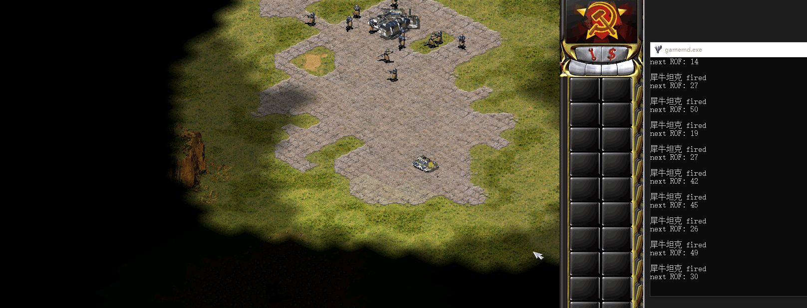
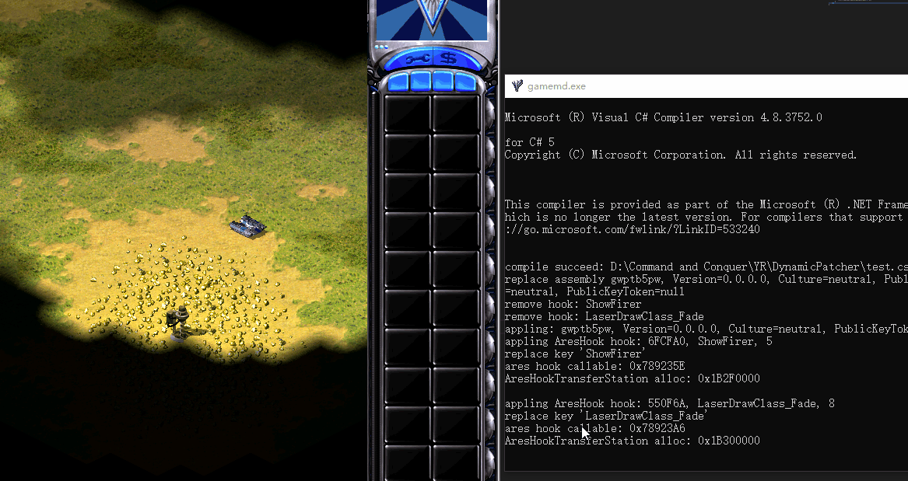

# YRDynamicPatcher

[](https://www.gnu.org/licenses/gpl-3.0.en.html)

**Dynamic Patcher** work differently from [Ares](https://github.com/Ares-Developers/Ares). It can dynamic patch Yuri's Revenge by dynamic compiling the C# code and syringe the binary code to Yuri's Revenge.

It give a completely different way to write our extension features.
We can use it to do something below:
- use the very nice reflection technique in C#
- use "\*.cs" file as a script, which mean it can be a weapon script, map script and so on.
- coding when the game is running, without restarting the game.
- without building a dll file. instead, we can use "\*.cs" file as hotfix.

**Features**
============
- **Hook Type**
  - Ares style hook
  - Direct jump to hook function
  - Direct jump to address
  - Write bytes to address
- Recoverable Hook
- Recoverable Hook from Exception
- Dynamic Compile & Syringe Technique


Examples
--------






Usage
--------
Put `PatcherLoader.dll` and `DynamicPatcher.dll` on your YR directory and launch Syringe targeting your YR executable (usually `gamemd.exe`).

Create the directory `DynamicPatcher` and put `dynamicpatcher.config.json` & `compiler.config.json` on it.

Create the directory `DynamicPatcher\Libraries` and put necessary assembly on it.

Everythings could be gained from released files.(recommend)

The patcher will search exist files at first or detected every file changes later. Next compile the file and syringe.

**Patcher will compare the code files and compiled assemblies to skip unnecessary compile.** If you meet some stranger problem, try deleting the directory `DynamicPatcher\Build`.

Hook
--------
Each hook are writed like the below

``` csharp
namespace PatcherSample
{
    public class HookTest
    {
        [Hook(HookType.AresHook, Address = 0x6FCFA0, Size = 5)]
        static public unsafe UInt32 ShowFirer(REGISTERS* R)
        {
            ref TechnoClass rTechno = ref ((Pointer<TechnoClass>)R->ESI).Ref;
            ref TechnoTypeClass rType = ref rTechno.Type.Ref;
            ref HouseClass rHouse = ref rTechno.Owner.Ref;
            unsafe
            {
                string ID = rType.Base.GetUIName();
                string HouseID = rHouse.Type.Ref.Base.GetUIName();
                Logger.Log("{0}({1}) fired", ID, HouseID);
            };
            int rof = 1919810;
            if (rTechno.Owner == HouseClass.Player)
            {
                rof = new Random().Next(0, 50);
            }
            else
            {
                rof = new Random().Next(114, 514);
            }
            Logger.Log("next ROF: " + rof);
            R->EAX = (uint)rof;
            Logger.Log("");

            return 0x6FCFBE;
        }
    }
}
```

Configuration
--------
the file `DynamicPatcher\dynamicpatcher.config.json` explanation:

`try_catch_callable` : try-catch invoke a hook function.

`force_gc_collect` : forces garbage collection per 10s.

`hide_console` : hide the console during start-up.


the file `DynamicPatcher\compiler.config.json` explanation:

`references` : the assemblies it referenced.

`show_hidden` : show hidden message of compiler

`load_temp_file_in_memory` : load temp file into memory. set false if want to Save & Load. set true if want to modify code dynamically.

`emit_pdb` : emit pdb message

`force_compile` : force compile all files at start-up.

[YRPP](https://github.com/Xkein/PatcherYRpp)
--------
The c# style YRPP is WIP.

[DynamicPatcher based Extensions](https://github.com/Xkein/PatcherExtension)
--------
The framework is designed in Sample.
It has some simple feature below:
- Multi-extension manage
- BulletScript
  - OnUpdate
- TechnoScript
  - OnUpdate
  - OnFire
- Update script when recompiling (unsafe)
- Save & Load

Legal
-----
This project has no direct affiliation with Electronic Arts Inc. Command & Conquer, Command & Conquer Red Alert 2, Command & Conquer Yuri's Revenge are registered trademarks of Electronic Arts Inc. All Rights Reserved.
